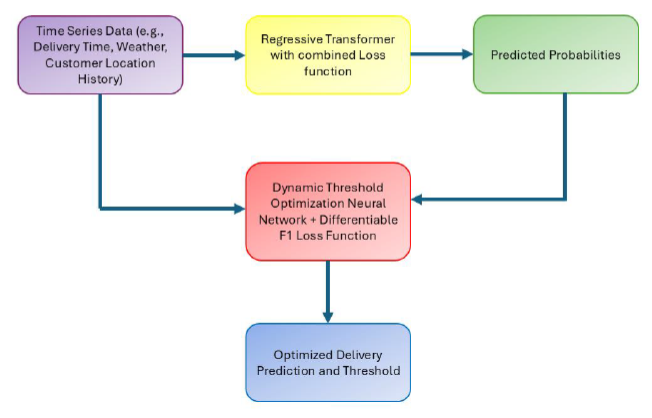
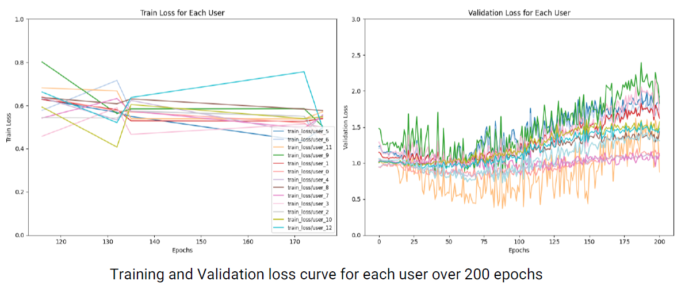
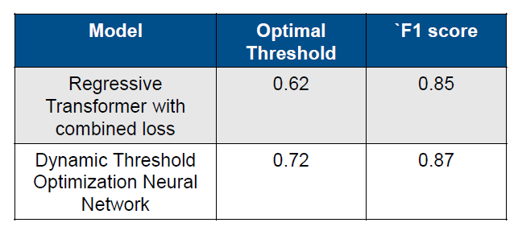

# 🌍 Differentiable Threshold Optimization (DTO) for Transformer Models
### Advanced Geospatial Classification 

## 💡 The Problem: The "Failed Delivery" Crisis
In logistics, failed deliveries contribute to **1 billion extra miles** and massive carbon emissions annually. Standard classification models use a fixed decision threshold (0.5), which is often sub-optimal for complex, noisy geospatial data. 

**My Solution:** A Transformer-based framework that treats the decision threshold as a **learnable parameter**, optimizing it directly through backpropagation to minimize misclassification and maximize environmental efficiency.

---

## 🏗️ Architecture: Transformer + DTO
The system uses a Transformer backbone to capture long-range spatial dependencies, followed by a custom **Differentiable Thresholding Layer**.

*Figure 1: Pipeline showing Geospatial Input -> Transformer Encoder -> Differentiable Thresholding Module.*

> **Key Innovation:** Traditional thresholds are "step functions" (not differentiable). I implemented a **Sigmoid-based approximation** to allow gradients to flow back to the threshold parameter, enabling the model to "learn" where the boundary should be.

---

## 📊 Methodology & Optimization
### 1. Data Handling (Green Convenience)
The model was trained on large-scale logistics data, focusing on "Green Convenience"—reducing the carbon footprint by predicting delivery success with higher precision.

### 2. Combined Loss Function
Instead of just Binary Cross-Entropy, I developed a combined loss function that optimizes for both accuracy and the specific F1-score threshold.

*Figure 2: Visualization of the Differentiable Threshold learning process during training.*

---

## 📈 Key Results
The DTO framework outperformed standard Regressive and baseline Transformer models across all key metrics.

| Model | Optimal Threshold | F1 Score |
| :--- | :--- | :--- |
| **Standard Regressive** | 0.62 | 0.85 |
| **Transformer (Baseline)** | 0.50 | 0.81 |
| **DTO-Transformer (Ours)** | **0.72** | **0.87** |

*Figure 3: Comparison of misclassification rates between static and dynamic thresholding.*

---

## 🛠️ Technical Stack
* **Deep Learning:** PyTorch, Transformer Encoders.
* **Optimization:** Differentiable Thresholding, Custom Loss Functions.
* **Geospatial Analysis:** Feature engineering for spatial time-series data.
* **Tools:** Python, NumPy, Pandas, Matplotlib.

## 📁 Repository Structure
* Implementation of the DTO layer and Transformer architecture.
* Pre-processed geospatial datasets.
* Training pipelines and hyperparameter tuning.
* Trained weights for the DTO-Transformer.

---

## 🎓 Academic Recognition
This research was defended at **TU Darmstadt (Self-Organizing Systems Lab)** under the supervision of Prof. Dr. Heinz Koeppl. It represents a significant step in making deep learning models more adaptive to real-world business constraints.

**Author:** [Mitalee Garg](https://www.linkedin.com/in/mitaleegarg)
